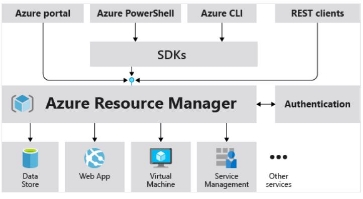

I.1 Implement IaaS solutions 

jeudi 16 septembre 2021  14:17 

Provision virtual machines (VMs)  

1. Take care of the network and choose address spaces for the virtual network. If virtual networks, the address spaces must not overlap. **Address space:** The range of private addresses that virtual machines and services on your network can use. 
1. **Segment the network into subnets: Ex** 
- 10.1.0.0 for VM 
- 10.2.0.0 for backend services 
- 10.3.0.0 for databases 

/!\ In each subnet, Azure reserves the first 4 addresses + the last 

3. **Securize** the network 

By default, all components in the same subnet can communicate without limitations. It is possible to configure network security groups that will act as software firewalls at the subnet or virtual machine level. 

4. **Configure** the VM  
- **Name** : Consistent, which easily determines the role of each VM. Include: Environment, Location, Instance, Product or Service, Role. For example, devusc-webvm01 can represent the first web development server hosted in the US South Central location. 
- **Location** : The closest to users. /!\ config and cost may vary by region. 
- **Size** : Azure provides a list of possible sizes. Ability to change this size but reboot required. To be chosen according to the type of workload 
  - General usage 
  - Optimized for computation 
  - Optimized memory 
  - Optimized storage 
  - GPU 
  - High performance computation 
- **Payment option :** Pay as you go or 1/3 years reserved. 
- **Stockage de la VM :** 2 hard drive by VM : 1 permanent storing the OS and 1 temporary. It is possible to add temporary ones. Data from each virtual hard drive** are stored in a storage account (page blob). 
- **OS** : Influences the cost. It is possible to install a stack image in the azure marketplace. 

Ability to create VMs via the azure portal but also via Azure Powershell or Azure CLI or by Azure REST APIs: 

- **Powershell :**  
  - New-AzResourceGroup -Name myResourceGroup -Location EastUS 
  - New-AzVm ` -ResourceGroupName "myResourceGroup" ` -Name "myVM" ` -Location "East US" ` -VirtualNetworkName "myVnet" ` - SubnetName "mySubnet" ` -SecurityGroupName "myNetworkSecurityGroup" ` -PublicIpAddressName "myPublicIpAddress" ` -OpenPorts 80,3389 
  - Get-AzPublicIpAddress -ResourceGroupName "myResourceGroup" | Select "IpAddress" 
  - mstsc /v:publicIpAddress 
  - Install-WindowsFeature -name Web-Server -IncludeManagementTools 
- **Azure CLI :** 
  - az group create --name myResourceGroup --location eastus 
  - az vm create \ --resource-group myResourceGroup \ --name myVM \ --image Win2019Datacenter \ --public-ip-sku Standard \ -- admin-username azureuser  -> possible to enable disk encryption with --enabled-for-disk-encryption 
  - Enable disk encryption : **az vm encryption enable** 
  - az vm open-port --port 80 --resource-group myResourceGroup --name myVM 
  - ssh azureuser@<publicIPAddress> 
  - sudo apt-get -y update sudo apt-get -y install nginx 

**VM Azure Extension** : Small applications that allow you to add post-deployment services:  

- Run Custom Scripts via Custom Script Extension 
- Deply & Manage configurations via PowerShell Desired State Configuration 
- Collect Diagnostics data via Azure Diagnostics extension 

**Azure Automation** : Advanced operations for large infrastructure: Process automation, configuration management, update management. Example : Hybrid Runbook Worker. 

**Availability set :** A logical group of VMs that allows Azure to understand how the application is built to provide redundancy and availability. Management of **VM Availability** : 

- **High availability group :** Deploy multiple instances of each VM to ensure that they do not fart at the same time or that the updates are done at the same time. 
- **Azure Site Recovery :** Replication of infrastructures across multiple sites and failover if failure. Also manages failover tests for recovery exercises. 
- **Azure backup**  : Makes backups of data periodically. Offers many advantages over traditional backup solutions. 

**Virtual Machine Scale Set :** 

Create and manage a group of load balanced VMs. The number of instances can automatically increase or decrease in response to demand or a defined schedule. 

**Network Security Group (NSG)** 

When we created the virtual machine, we selected the incoming SSH port so that we could connect to the virtual machine. This created a network security group (NSG) attached to the virtual machine's network interface. This NSG group blocks HTTP traffic. This NSG group must be updated to allow inbound HTTP traffic on port 80.  

Configure, validate, and deploy ARM templates  

**Def :**  

**Why**  

- Declarative syntax 
- Idempotency 
- Orchestration of the deployment of interdependant resources 

**Access ARM resources from VM** 

**ARM template example :**  { 

"$schema": "[https://schema.management.azure.com/schemas/2019-04-01/deploymentTemplate.json#](https://schema.management.azure.com/schemas/2019-04-01/deploymentTemplate.json)", "contentVersion": "1.0.0.0", 

"**parameters**": { 

"demoString": { 

"type": "string" 

} 

}, 

"**variables**": { 

"stringVar": "example value" 

}, 

"**functions**": [{}], 

"**resources**": [], 

"**outputs**": { 

"nameResult": { 

"type": "string", 

"value": "[variables('user')['user-name']]" } 

} 

} 

**copy :** parameter of the resources section to deploy multiple instances of the resource. **copyIndex :** function returning the current iteration in a loop. Zero-based. 

**dependsOn :** Array of strings defining which resources the aimed resource is dependent on. 

You can use a conditional deployment to create a new resource or use an existing one. It contains a parameter named **newOrExisting**, used as condition in section named **resources**. 

"condition": "[equals(parameters('newOrExisting'), 'new')]", **Export ARM template of a resource group (and resources inside)** Use **az group export** command. 

**Deploy :**  

- **Powershell :**  
  - $templateFile = "{provide-the-path-to-the-template-file}"  

New-AzResourceGroupDeployment ` -Name blanktemplate ` -Mode Complete -ResourceGroupName myResourceGroup ` -TemplateFile $templateFile 

- **Azure CLI :**  
  - $templateFile="{provide-the-path-to-the-template-file}"  

az deployment group create \ --name  

` `blanktemplate \ --mode Complete --resource-group myResourceGroup \ --template-file $templateFile **Deployment mode** : 

- **complete** : Deletes resources that exist in the resource group but are not specified in the template. 
- **Incremental** : keeps resources that exist in the resource group as they are, but are not specified in the template. 

**Validate :**  

By hand in the portal or via azure cli,  **command az <resource> show** on the ARM created resources.  Ex : az storage account show --resource-group az204-arm-rg --name <myStorageAccount> 

Configure container images for solutions  

1. Create dockerfile 

FROM node:8.9.3-alpine  

RUN mkdir -p /usr/src/app  COPY ./app/ /usr/src/app/  WORKDIR /usr/src/app  

RUN npm install  

CMD node /usr/src/app/index.js 

2. Create image with tag aci-tutorial-app 

docker build ./aci-helloworld -t aci-tutorial-app 

3. Execute the container locally 

docker run -d -p 8080:80 aci-tutorial-app (map le port 80 du conteneur avec le port 8080 du docker host Create local docker based on "Hello world" image from Microsoft 

echo FROM mcr.microsoft.com/hello-world > Dockerfile 

Dockerfile example for **.NET**  

Publish an image to the Azure Container Registry  

**Use cases :**  

- Scalable orchestration systems that manage containerized applications across clusters of hosts, including Kubernetes, DataCenter operating systems, and Docker Swarm. 
- Azure services that support building and running applications at scale, including Azure Kubernetes Service (AKS), App Service, Batch, Service Fabric, and others. 

**ACR Levels** (influences storage capacity and images throughput) :  

- Base  
- Standard 
- Premium : adds **geo-replication**, **content approval** for signing image tags and a **private link** with private endpoint to limit access to the registry. 

**Push & Run image from Dockerfile** 

1. Create ACR 

az acr create --resource-group myResourceGroup --name <acrName> --sku Basic 

2. Build and push docker image in ACR from local Dockerfile 

**echo FROM** mcr.microsoft.com/hello-world > Dockerfile **az acr build** --image sample/hello-world:v1  \ 

`    `--registry <myContainerRegistry> \ 

`    `--file Dockerfile . 

3. Check  

**az acr repository list** --name <myContainerRegistry> --output table 

4. Run image :  

**az acr run** --registry <myContainerRegistry> \ --cmd '$Registry/sample/hello-world:v1' /dev/null 

Run containers by using Azure Container Instances 

**Why**: For scenarios that can work in isolated containers, including basic applications, automate tasks and create build jobs. 

**Pros :**  

- Fast start 
- Easy access to the container (direct exposure to the global internet via IP or FQDN) 
- Complete isolation 
- Stores only what is necessary in terms of customer data 
- Optimal size 
- Persistent storage (Azure files) 
- Linux & Windows (single container) 

**Container groups :**  

A collection of containers that share a lifecycle, resources, latch network, and storage volume. = **Pod**.  

The beyond container group :  

- Is scheduled on one host machine. 
- Has a DNS. 
- Expose one IP and one port (80). 
- Contains 2 containers, the one that listens on port 80 (outside) and the one that listens on port 5000 (inside the container). 
- Contains 2 Azure files shares as mounted volumes, and each container mounts 1 of the on-premises volumes. 

` `**Multi-container group deployment :** ARM template or YAML (recommended). Only Linux. 

**Resource allocation :** If we create a container group with 2 instances each requiring 1 CPU, then we allocate 2 CPUs to the container group. 

**Network :** Containers groups share an IP address and a namespace port on that IP. To allow access to a container in the group, you must expose a port on the external IP and from the container. Containers in the group can chat together with localhost and the ports they have exposed internally. 

**Storage :** Mountable volumes :  

- Azure file Share 
- Secret 
- Empty directory 
- Cloned git repository 

**Manage container instances using Azure CLI :**  

- Create a service principal and retrieve the id and password. 

SP\_PASSWD=$(az ad sp create-for-rbac --name $SERVICE\_PRINCIPAL\_NAME --scopes $ACR\_REGISTRY\_ID --role acrpull --query password -- output tsv) 

SP\_APP\_ID=$(az ad sp list --display-name $SERVICE\_PRINCIPAL\_NAME --query [].appId --output tsv) 

- Deploy container 

az container create --resource-group myResourceGroup --name aci-tutorial-app --image <acrLoginServer>/aci-tutorial-app:v1 --cpu 1 --memory 1 --registry-login-server <acrLoginServer> --registry-username <service-principal-ID> --registry-password <service-principal-password> --dns-name- label <aciDnsLabel> --ports 80 

- Check deployment state 

az container show --resource-group myResourceGroup --name aci-tutorial-app --query instanceView.state 

- List containers : **az container list** (rg, query ex : value[].[name,provisioningState] 
- See logs : **az container logs** 
- Delete a container : **az container delete** 

**Restart policy** : option du az container create : --restart-policy 

- Always : (default) 
- Never  
- OnFailure  

**Set environment variables :** option for az container create : --environment-variables **Secure values :**  

**Azure file share** 

By default ACI is stateless. For persistence, use Azure File share. Several ways to deploy:  

- Azure CLI  

- Yaml 

Create, Build & Run docker images in the cloud 

**ACR Tasks :** Configure ACR Tasks to automatically rebuild application images when their base images are updated, or automate image builds when your team commits code to a Git repository. Create multi-step tasks to automate building, testing, and patching multiple container images in parallel in the cloud. 

Multiple task scenario 

- **Quick** task = docker build & docker push in the cloud 
- **Triggered** task = basé sur du source code update, base image update ou schedule 
- **Multi-step** task = Plusieurs Quick task  

Each task is associated to a code source context = Where to find the code (Ex : git repo ou local filesystem) **Create ACR task :**  

- **in Azure CLI :** Example with a task that recreates the image automatically when the source code changes in a git repo:  

**az acr task create** --registry <container\_registry\_name> --name buildwebapp --image webimage --context <distant\_git\_repo> -- branch-master --file Dockerfile --git-access-token <access\_token> 

- **In yaml** 

