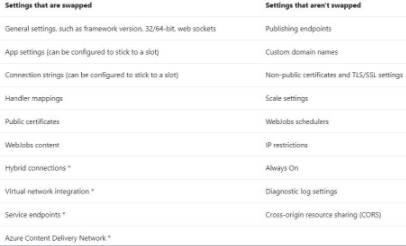
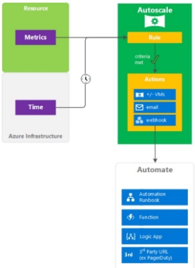
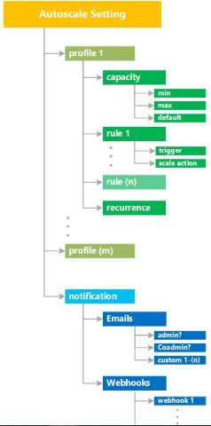

I.2 Create Azure App Service Web Apps 

jeudi 16 septembre 2021  14:20 

Create an Azure App Service Web App  

1. Create an **App Service Plan** 
- **Region** 
- VM **number** 
- VM **Size** 
- **Pricing Tier** : 
- Free/Shared : 1 go, 60 min 
- Basic : from 1,75go/100 ACU(Azure compute unit) to 7go/400 ACU, but manual scale 
- Standard : 5 autoscale instance, 10 backup/day 
- Premium/PremiumV2/PremiumV3 : 20 autoscale instance, 20 staging slots, 20 backup/day 
- Isolated: Single tenant system, isolated network, internal load balancing 

**az appservice plan create** --name WEB\_APP\_NAME --resource-group RESOURCE\_GROUP\_NAME --sku SKU\_NAME 

2. **Create webapp in azure, using the App service plan** 

**az webapp create** --name WEB\_APP\_NAME --resource-group RESOURCE\_GROUP\_NAME --**plan** APP\_SERVICE\_PLAN\_NAME 

From **docker** image in ACR :  

az webapp create 

--resource-group myResourceGroup  

--plan myAppServicePlan  

--name <app-name>  

--deployment-container-image-name <registry-name>.azurecr.io/appsvc-tutorial-custom-image:latest 

Or directly from the app created locally (place in the directory containing the code): 

az webapp up 

` `--sku F1  

` `--name <app-name>   --os-type <os> 

**Deployment slots** 

Can be used in Standard, Premium or Isolated plan tier. 

App content & configurations can be swapped. 

To validate app changes. 

To warm-up the app before prod -> eliminate downtime/latency. If problem, swap again. 

**Custom warm-up**  

Or via the following app settings :  

Enable diagnostics logging  

az webapp log config  

--name MyWebapp  --resource-group MyResourceGroup  --web-server-logging off 

Deploy code to a web app  

The code is in a local zip:  

dotnet publish 

cd pub 

Zip –r site.zip \* 

**az webapp deployment source** config-zip \ 

`    `--src site.zip \ 

`    `--resource-group learn-32f93c43-419e-4381-9230-32a59ab5d922 \     --name <your-unique-app-name> 

The code is in an docker image in an ACR :   

az webapp config container set  

--name <app-name>  

--resource-group myResourceGroup  

--docker-custom-image-name <registry-name>.azurecr.io/appsvc-tutorial-custom-image:latest  --docker-registry-server-url [https://<registry-name>.azurecr.io](https://%3Cregistry-name%3E.azurecr.io/)

Configure web app settings including SSL, API settings, and connection strings  

**SSL** :  

- Upload the SSL certificate and get the thumbprint.  thumbprint=$(**az webapp config ssl upload**  --certificate-file $pfxPath   --certificate-password $pfxPassword  

--name $webappname  

--resource-group $resourceGroup   

--query thumbprint 

` `--output tsv)  

- Binds the uploaded SSL certificate to the web app.  az webapp config ssl bind  

--certificate-thumbprint $thumbprint  --ssl-type SNI   

--name $webappname  

--resource-group $resourceGroup 

**Connection String** : (Ex avec une CS de type mysql) 

az webapp config connection-string set -g MyResourceGroup -n MyUniqueApp -t mysql \  --settings mysql1='Server=myServer;Database=myDB;Uid=myUser;Pwd=myPwd;' 

Accepted values (-t) : ApiHub, Custom, DocDb, EventHub, MySql, NotificationHub, PostgreSQL, RedisCache, SQLAzure, SQLServer, ServiceBus 

Implement autoscaling rules including scheduled autoscaling and autoscaling by operational or system metrics 

**Scheduled** autoscaling :   

az monitor autoscale profile create   

--autoscale-name MyAutoscale   --count 2   

--max-count 10  

--min-count 1 

--name Christmas  

--recurrence week sat sun  --resource-group MyResourceGroup  --start 2018-12-24 

--subscription MySubscription  --timezone "Pacific Standard Time" 

Autoscaling **by system metric** :  

Out => monter 

In => descendre Horizontal : VM instances Vertical : VM power 

**Get** autoscale settings by name and resource group :  

