I.3 Implement Azure functions 

jeudi 16 septembre 2021  14:23 

Create and deploy Azure Functions apps  

**Consumption plan types :**  

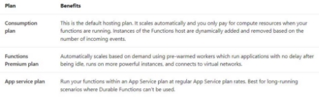

**Hosting options** : 

- App Service Environment (ASE) : the classic one, fully isolated and dedicated environement. Always on option must always be activated in order to avoid "wake- up" latency effect. 
- Kubernetes : fully isolated & dedicated environment on top of Kubernetes platform. Uses KEDA.  

**Storage account requirements :**  

- General SA supporting Blob, Queue, File & Table storage. 
1. **Create** 

2. **Deploy** 
- publish the code 

dotnet publish -c Release 

$publishFolder = "FunctionsDemo/bin/Release/netcoreapp2.1/publish" 

- create the zip 

$publishZip = "publish.zip" 

if(Test-path $publishZip) {Remove-item $publishZip} 

Add-Type -assembly "system.io.compression.filesystem" [io.compression.zipfile]::CreateFromDirectory($publishFolder, $publishZip) 

- deploy the zipped package 

az functionapp deployment source config-zip ` 

` `-g $resourceGroup -n $functionAppName --src $publishZip 

Implement input and output bindings for a function  

**Example with a blob trigger**  Project structure :  

The following example is a [C# function](https://docs.microsoft.com/en-us/azure/azure-functions/functions-dotnet-class-library) that uses a blob trigger and two output blob bindings.  

The function is triggered by the creation of an image blob in the *sample-images* container. It creates small and medium size copies of the image blob. 

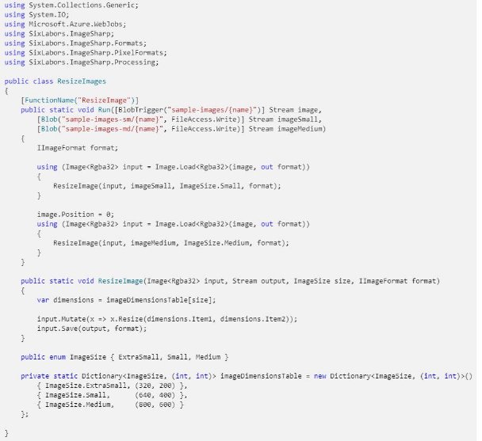

Implement function triggers by using data operations, timers, and webhooks  

1. **Function trigger by using data operations** 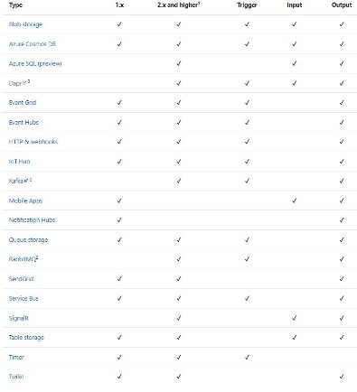
2. **Function trigger by using timer** 

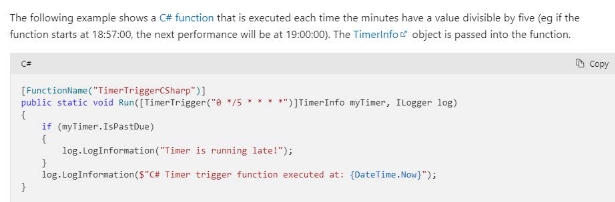

Azure functions : **CRON** Expressions (Timer Trigger) 

\- **Format :  {seconde} {minute} {heure} {jour} {mois} {jour de la semaine}** "\*" = tout "/" = "chaque 

"-" = plage 

"," = et 

3. **Function trigger by using webhook**  

**Webhook** : Request that is made on a certain url (configured at the time of the creation of the webhook) when an event occurs. Example: When the wiki page of a github repository is modified, a webhook configured in github sends the information of the modification (who, when, etc...) to an azure function that displays them. 

Possible to **secure the webhook with a secret** to be sure that the requests come from an approved source. **x-hub-signature** header.  As part of an azure function, **webhook is a behavior of the HTTPTrigger**, only usable for an **azure function v1. 3** possible webhooks: 

- **genericJson**—A general-purpose webhook endpoint without logic for a specific provider. This setting restricts requests to only those using HTTP POST and with the application/json content type. 
- **Github** 
- **Slack** 

Implement Azure Durable Functions  

Long and stateful operations (conserve les informations d'état entre les appels de fonctions)  -> Event-based code 

` `-> chainage de fonctions qui peuvent être appelé sync ou async 

4 types of durable functions :  

- **Client** : entry point, instantiates orchestration, so uses durable client output binding 
- **Orchestration** : to describe how actions (activity) are performed and the order ([OrchestrationTrigger]) 
- **Activité** : basic work unit, 
- **Entity** : read and update small parts of state 

Example :  

Patterns :  

- **Chaînage** 

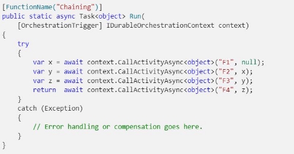

- **Fan-out/Fan-in** :  

This model runs multiple functions in parallel and then waits for all the functions to finish executing. The results of parallel runs can be aggregated or used to calculate a final result. 

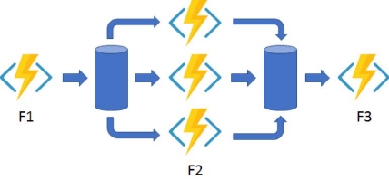

•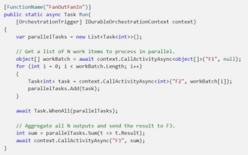

- **API HTTP Async** :to coordinate the status of time-consuming operations with external customers. 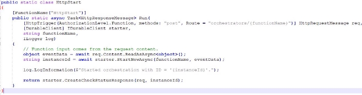

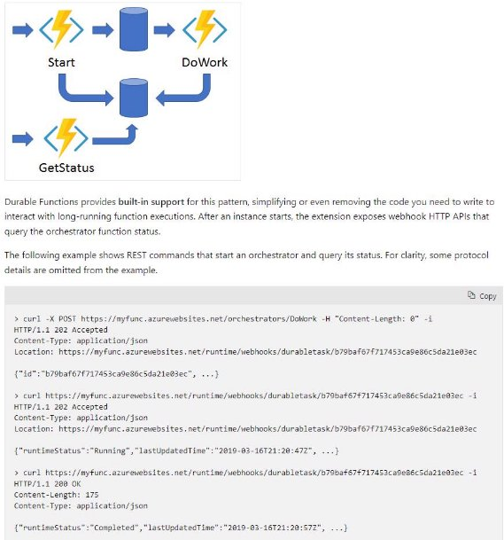

- **Monitor**: recurring process: Ex: poll until a specific condition is met. 

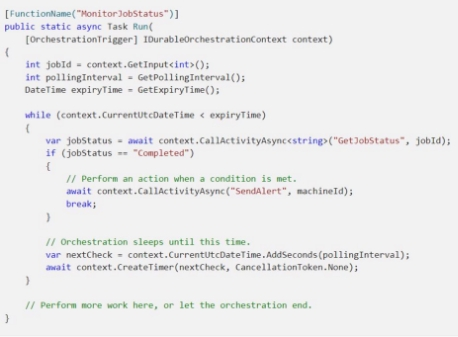

- **Human interaction** 

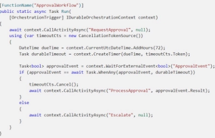

Task hubs 

A task hub in Durable Functions is a logical container for durable storage resources that are used for orchestrations and entities. Orchestrator, activity, and entity functions can only directly interact with each other when they belong to the same task hub. 

Implement custom handlers 

**Définition :** Small web servers that receive events from a "host" function. Any language that supports HTTP primitives can implement a custom handler.  We can use triggers, input & output bindings via extension bundles 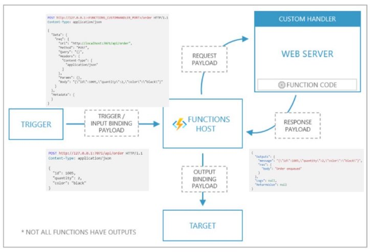

**Structure :**  

- A *host.json* file always at the root of your app. Les extensions bundles are referenced in host.json. 

- A *local.settings.json* file at the root of your app. 

- A *function.json* file for each function (inside a folder that matches the function name). 

This function is defined as an [HTTP triggered function](https://docs.microsoft.com/en-gb/azure/azure-functions/functions-bindings-http-webhook-trigger) that returns an [HTTP response](https://docs.microsoft.com/en-gb/azure/azure-functions/functions-bindings-http-webhook-output) and outputs a [Queue storage](https://docs.microsoft.com/en-gb/azure/azure-functions/functions-bindings-storage-queue-output) message. 

- A command, script, or executable, which runs a web server.  
