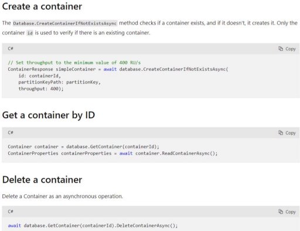

II.1 Develop solutions that use Cosmos DB storage 

jeudi 16 septembre 2021  14:24 

Resources hierarchy 

- An Azure Cosmos container is the unit of scalability both for provisioned throughput and storage.  
- A container is horizontally partitioned and then replicated across multiple regions.  
- The items that you add to the container are automatically grouped into logical partitions, which are distributed across physical partitions, based on the partition key.  
- The throughput on a container is evenly distributed across the physical partitions. 
- When you create a container, you configure **throughput** in one of the following modes: 
- **Dedicated** provisioned throughput mode: The throughput provisioned on a container is exclusively reserved for that container and it is backed by the SLAs. 
- **Shared** provisioned throughput mode: These containers share the provisioned throughput with the other containers in the same database (excluding containers been configured with dedicated provisioned throughput). In other words, the provisioned throughput on the database is shared among all the “shared throughp containers. 
- A container is a schema-agnostic container of items.  
- Items in a container can have arbitrary schemas. For example, an item that represents a person and an item that represents an automobile can be placed in the same c
- By default, all items that you add to a container are automatically indexed without requiring explicit index or schema management. 

Select the appropriate API and SDK for a solution  

For product catalog data, Azure Cosmos DB is the preferred choice : 

- Supports semi-structured data, json: flexibility in schema. 
- Support sql for queries. 
- ACID Compliant. 
- Replication. 
- Fine-grained cost management with the ability to choose consistency levels to determine trade-offs between consistency, availability, latency, and throughput. 
- **Core(SQL) API** :  
  - Stores data in document format 
  - Query using SQL syntax 
  - Recommended option when migrating from other databases. 
- **Api for MongoDB** 
- Stores data in document structure 
- Use with MongoDB ecosystem 
- **Cassandra API** 
- Stores data in column-oriented schema 
- Use with Cassandra ecosystem 
- **Table API** 
- Stores data in key/value format  
- When you want to migrate from Azure Table storage for better latency, scaling, throughput and performance 
- **Gremlin API** 
- For Graph queries, stores data as edges and vertices 
- Use with dynamic data with complex relations 
- Use with Gremlin ecosystem 

Request Units 

When creating an Azure Cosmos account :  

- **Provisioned throughput mode** : provision the number of RUs for your application on a per-second basis in increments of 100 RUs per second. 
- **Serverless mode** : At the end of your billing period, you get billed for the amount of request units that has been consumed by your database operations. 
- **Autoscale mode :** You can automatically and instantly scale the throughput (RU/s) of your database or container based on it's usage. 

Implement partitioning schemes and partition keys  

**Partition key = path + value** (ex: /"userId" + "Andrew") 

It must be :  

- Non updatable 
- Large field of possible values (no duplicates) 

Perform operations on data and Cosmos DB containers  

**SQL requests examples** 

**Create Cosmos in Azure** 

**Create .NET app** 

dotnet new console --langVersion:8 -n todo 

dotnet add package Azure.Cosmos --version 4.0.0-preview3 

**Resource hierarchy in CosmosDB**: Azure Cosmos Account > Databases > Containers > Items **Classes & methods in .NET :**  

- CosmosClient : base class 
- CreateDatabaseIfNotExistsAsync, CreateContainerIfNotExistsAsync, CreateItemAsync 

, UpsertItemAsync, GetItemQueryIterator, DeleteAsync 

**Using :** using Azure.Cosmos; 

**Database** 

**Containers** 

`  `**Items** 

**Use the feedIterator** 

**Stored procedures : Register and call** 

**Pre-trigger : Register and call** 

**Post-trigger : Register and call** 

**User-defined functions** 

Set the appropriate consistency level for operations  

\1. Strong  

Reads are guaranteed to see the most recent write 

Bounded staleness 

Bounded staleness is frequently chosen by globally distributed applications that expect low write latencies but require total global order guarantee is introduced before information is available on all regions. This consistency level includes implementation of consistent prefix, whch guarantees th writes are returned in order. You can configure staleness, which determines the data version returned, based on either the number of versions or o delay.

Session 

Session consistency is the most widely used consistency level for both single region as well as globally distributed applications. This is the default consistency model. Only support a single client session. You can't know data version (staleness).

Consistent prefix 

Consistent Prefix provides write latencies, availability, and read throughput comparable to that of eventual consistency, but also provides the orde guarantees that suit the needs of scenarios where order is important. Is guarantees that reads never see out of order writes. You have no staleness means you can't know the data version returned.

Eventual 

In eventual consistency, there's no ordering guarantee for reads. In the absence of any further writes, the replicas eventually converge. 

Eventual consistency is the weakest form of consistency because a client may read the values that are older than the ones it had read before. Even consistency is ideal where the application does not require any ordering guarantees.

Manage change feed notifications 

1. With Azure function 

2. With ChangeFeedProcessor 

