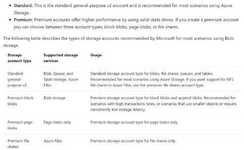
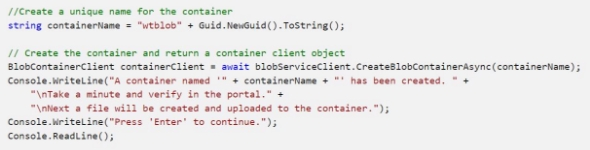
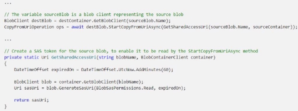
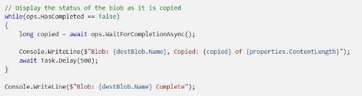
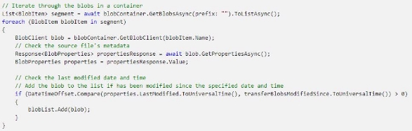
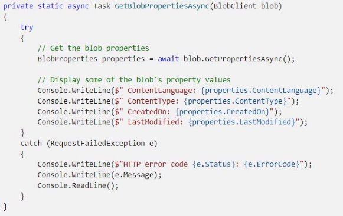
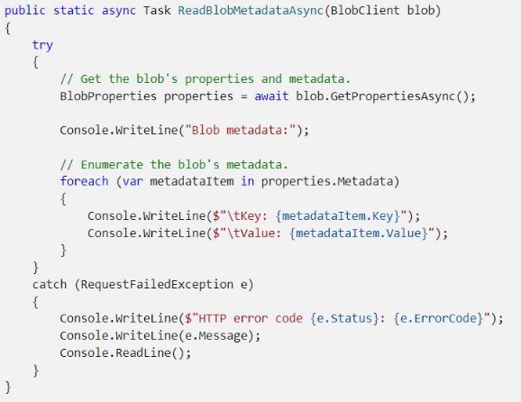
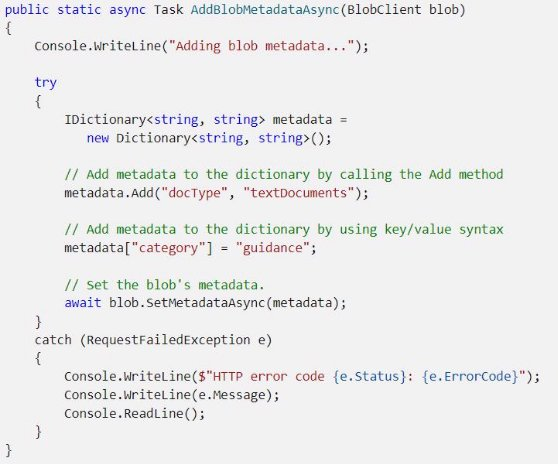
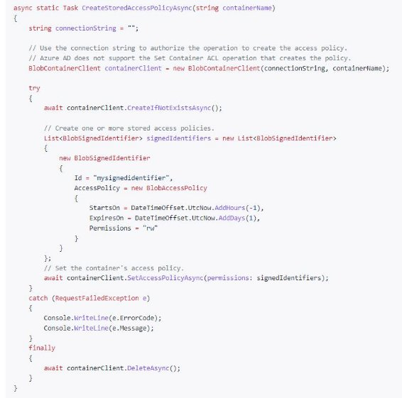
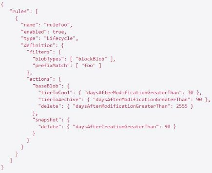

II.2 Develop solutions that use blob storage 

lundi 17 janvier 2022  14:15 

When to use Blob storage 

- Serving images or documents directly to a browser. 
- Storing files for distributed access. 
- Streaming video and audio. 
- Writing to log files. 
- Storing data for backup and restore, disaster recovery, and archiving. 
- Storing data for analysis by an on-premises or Azure-hosted service. 

Type of Storage accounts  

NFS = network file system + change feed support 

Access tiers for block blob data 

- Hot : frequent access, default one. 
- Cool : store large amount of data, infrequently accessed & stored for at least 30 days 
- Archive : Only for individual block blobs. Tolerate several hours of retrieval latency, remain for at least 180 days. Minimum GPv2. 

=> Can be changed at any time. 

Type of resources 

- **Storage account** : Allows you to formalize the requirements in terms of data storage in the cloud. Choice of **region, billing management, redundancy**. It groups together a set of azure storage services to which a set of parameters can be applied. A storage account is included in a resource group. Azure SQL and Cosmos DB are not included in a storage account. It provides a single namespace in Azure for data. Each piece of data has an address. For example, the default endpoint for a storage blob in the storage account mystorageaccount is http://mystorageaccount.blob.core.windows.net 
- **Containers** : A container organizes a set of blobs, similar to a directory in a file system. A storage account can include an unlimited number of containers, and a container can store an unlimited number of blobs. 
- **Blobs** :  
- **Block blobs** store text and binary data. Block blobs are made up of blocks of data that can be managed individually. Block blobs can store up to about 190.7 TiB. 
- **Append blobs** are made up of blocks like block blobs, but are optimized for append operations. Append blobs are ideal for scenarios such as logging data from virtual machines. 
- **Page blobs** store random access files up to 8 TiB in size. Page blobs store virtual hard drive (VHD) files and serve as disks for Azure virtual machines. 

Security 

- All data are encrypted by default, whatever the performance tier (Standard or Premium) 
- You can use Azure AD & RBAC on all operations on data 
- Data can be secured in transit (HTTPS) 
- OS & data disks are encrypted 
- Delegated access to the data objects in Azure Storage can be granted using a shared access signature. 

Redundancy 

- Primary region  
  - LRS : copy x3 in the same single physical location(=datacenter) 
  - ZRS : copy x3 in the primary region (different datacenters in the same region) 
- Secondary region 
  - GRS : LRS in primary region + LRS in secondary region 
  - GZRS : ZRS in primary region + LRS in secondary region 

Create Storage account 

Move items in Blob storage between storage accounts or containers  

**Connect to Azure blob storage** 

**Create a container**  

**Download a blob** 

**Upload a blob** 

**Copy blobs between storage accounts** 

**Delete a blob** 

**Iterate blobs in a container** 

Set and retrieve properties and metadata  

**Get properties on a blob** 

**Set properties on a blob** 

**Read metadata on a blob** 

**Set metadata on a blob** 

Implement storage policies, and data archiving and retention  

**Storage policies** 

**Data archiving** 

The Archive tier is an offline tier for storing data that is rarely accessed. The Archive access tier has the **lowest storage** **cost, but higher data retrieval costs and latency** compared to the Hot and Cool tiers. Example usage scenarios for the Archive access tier include: 

- Long-term backup, secondary backup, and archival datasets 
- Original (raw) data that must be preserved, even after it has been processed into final usable form 
- Compliance and archival data that needs to be stored for a long time and is hardly ever accessed 

Data must remain in the Archive tier for at least 180 days or be subject to an early deletion charge. For example, if a blob is moved to the Archive tier and then deleted or moved to the Hot tier after 45 days, you'll be charged an early deletion fee equivalent to 135 (180 minus 45) days of storing that blob in the Archive tier. 

While a blob is in the Archive tier, it can't be read or modified. To read or download a blob in the Archive tier, you must first rehydrate it to an online tier, either Hot or Cool. Data in the Archive tier can take up to 15 hours to rehydrate, depending on the priority you specify for the rehydration operation.  

An archived blob's metadata remains available for read access, so that you can list the blob and its properties, metadata, and index tags. Metadata for a blob in the Archive tier is read-only, while blob index tags can be read or written. Snapshots are not supported for archived blobs. 

The following operations are supported for blobs in the Archive tier: 

- [Copy Blob](https://docs.microsoft.com/en-us/rest/api/storageservices/copy-blob) 
- [Delete Blob](https://docs.microsoft.com/en-us/rest/api/storageservices/delete-blob) 
- [Find Blobs by Tags](https://docs.microsoft.com/en-us/rest/api/storageservices/find-blobs-by-tags) 
- [Get Blob Metadata](https://docs.microsoft.com/en-us/rest/api/storageservices/get-blob-metadata) 
- [Get Blob Properties](https://docs.microsoft.com/en-us/rest/api/storageservices/get-blob-properties) 
- [Get Blob Tags](https://docs.microsoft.com/en-us/rest/api/storageservices/get-blob-tags) 
- [List Blobs](https://docs.microsoft.com/en-us/rest/api/storageservices/list-blobs) 
- [Set Blob Tags](https://docs.microsoft.com/en-us/rest/api/storageservices/set-blob-tags) 
- [Set Blob Tier](https://docs.microsoft.com/en-us/rest/api/storageservices/set-blob-tier) 

` `**Note** 

- The Archive tier is not supported for ZRS, GZRS, or RA-GZRS(Read access) accounts.  
- Migrating from LRS to GRS is supported as long as no blobs were moved to the Archive tier while the account was set to LRS.  
- An account can be moved back to GRS if the update is performed less than 30 days from the time the account became LRS, and no blobs were moved to the Archive tier while the account was set to LRS. 

**Retention** 

**Azure Blob Storage** **lifecycle management** offers a rich, rule-based policy which you can use to transition your data to the best access tier and to expire data at the end of its lifecycle. 

**Lifecycle management policy** helps you: 

- Transition blobs to a cooler storage tier such as hot to cool, hot to archive, or cool to archive in order to optimize for performance and cost 
- Delete blobs at the end of their lifecycles 
- Define up to 100 rules 
- Run rules automatically once a day 
- Apply rules to containers or specific subset of blobs, up to 10 prefixes per rule 

Example 

Consider a data set that is accessed frequently during the first month, is needed only occasionally for the next two months, is rarely accessed afterwards, and is required to be expired after seven years. In this scenario, hot storage is the best tier to use initially, cool storage is appropriate for occasional access, and archive storage is the best tier after several months and before it is deleted seven years later. 

The following sample policy manages the lifecycle for such data. It applies to block blobs in container “foo”: 

- Tier blobs to cool storage 30 days after last modification 
- Tier blobs to archive storage 90 days after last modification 
- Delete blobs 2,555 days (seven years) after last modification 
- Delete blob snapshots 90 days after snapshot creation 

Add a lifecycle management policy with Azure CLI :  

**Change feed support** 

Goal : provide **ordered**, **guaranteed**, **durable**, **immutable**, **read-only** transaction logs of all the changes that occur to the blobs and the blob metadata in your storage account. 

When to use : well-suited for scenarios that process data based on objects that have changed. How it works :  

- Stored in a special container in your storage account.  
- Change events are appended to the change feed in Avro format. 
- Any number of client app can independently read the change feed in parallel, and at their own pace. 

Enable the change feed :  

- 1 change feed for the blob service in each storage account. Stored in **$blobchangefeed** container. 
- Change captures only at the **blob service** level. 
- Client app can filter out event types as required. 
- Can only be enabled on Standard General-purpose V2, premium block blob and blob storage accounts. 
