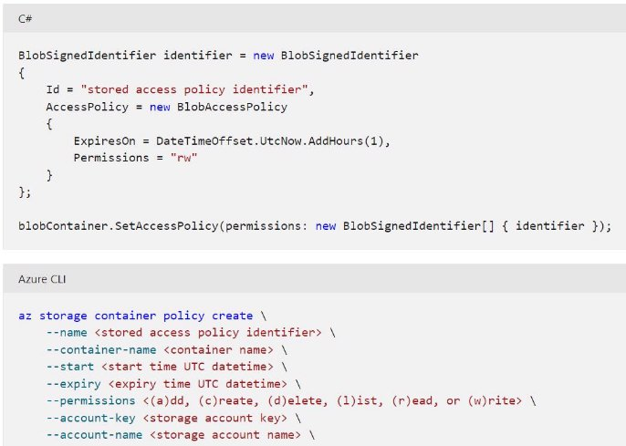

III.1 Implement user authentication and authorization 

jeudi 16 septembre 2021  14:29 

Authenticate and authorize users by using the Microsoft Identity platform  

**Authentication** 

- Provide that you are who you say you are. 
- Used to securely sign in a user to an application 
- Based on OpenIDConnect protocol. 

**Authorization** 

- Granting an authenticated party permission to do something. 
- What data you're allowed to access and what you can do with that data. 
- Based on OAuth2.0 protocol. 

**Service principals** 

Register app in AD (single or multi-tenant accessible) -> it automatically creates :  

- An **app object** (the globally unique instance of the app) = Template or blueprint to create one or more service principal objects (which inherits of app static properties). Cross tenant.  

The application object describes three aspects of an application: how the service can issue tokens in order to access the application, resources that the application might need to access, and the actions that the application can take. 

- A **service principal** object = Defines the access policy and permissions for the user/app in the AD tenant. A service principal must be created in each tenant where the application is used. This enables authentication/authorization for users/apps. 3 types :  
- **App** : local representation of an app object in a single tenant or directory. Defines what the app can actually do in the specific tenant, who can access the app, and what resources the app can access. 
- **Managed Identity** : Represents a managed identity.  Managed identities provide an identity for applications to use when connecting to resources that support Azure Active Directory authentication. When a managed identity is enabled, a service principal representing that managed identity is created in your tenant. Service principals representing managed identities can be granted access and permissions, but cannot be updated or modified directly. 
- **Legacy** : A service principal representing a legacy app (created before app registrations)  

**Permissions** 

Called **scopes** in Oauth 2.0. Represented as a string value in Microsoft Identity Platform. An app requests the permissions it needs by specifying the permission in the **scope** query parameter.  

Identity platform supports OpenID Connect standards scopes + Azure resource-specific scopes such as graph.microsoft.com/Calendars.Read 

Identity Platform exposes **/authorize** endpoint (the common one)+ **admin consent** endpoint(for high-privilege permissions). 

Permissions types :  

- **Delegated :** Used by apps that have a signed-in user present. The app is delegated with the permission to act as a signed-in user when it makes calls to the target resource. 
- **Application :** Used by apps that run without a signed-in user persent, for ex background services or daemons. Only an admin can concent to app permissions. 

Authenticate and authorize users and apps by using Azure Active Directory  

-> Token:  eyJ0eXAiOiJKV1QiLCJub25jZSI6IlVhU..... 

**IConfidentialClientApplication** 

Create and implement shared access signatures 

**Def** : URI that grants restricted access rights to Azure storage resources. **Usecases** 

Use a SAS when you want to provide secure access to resources in your storage account to any client who does not otherwise have permissions to those resources. 

**Types of SAS** :  

- **User delegation** : Secured with AD credentials & the permissions specified by the SAS. Applies to blob storage only. 
- **Service** : Secured with the storage account key. Delegates access in : Blob, Queue, Table, Files. 
- **Account** : Secured with the storage account key. Delegates access in one or more of the storage services. 

All the operations available via a service or user delegation SAS are also available via an account SAS. 

**How it works :**  

SAS = URI (to the resource to access) + SAS token 

**SAS token composition :** 

**Best practices**  

- Use HTTPS to distribute SAS 
- Use user-delegation SAS because it removes the need to store your storage account key in code. You must use Azure Active Directory to manage credentials 
- Expiration time : smallest useful value 
- Only grant access that is required 

**Stored access policy** 

**Def :** SAS policy = start time + expiry time + permissions for the signature. Used to manage constraints (permissions, start time and end time) for more than one SAS. 

When creating a SAS URI you can specify the name of the stored access policy instead of all the parameters required on the ad hoc version. When authorization happens, ther required information is retrieved from the stored access policy.  

To create/modify/delete stored access policy, call the **Set ACL** operation for the resource with a request body that specifies the terms of the access policy. (30 sec effect) 

The big advantage is not only defining the attributes of access for each creation, but also how we revoke the SAS. You can revoke it by changing the expiry time on the policy, or simply deleting the policy itself. Then, all SAS URI’s that inherit from that stored access policy will immediately be modified. This is preferable to changing your storage account

keys which could have severe impact on your applications. 

**Dev :**  

