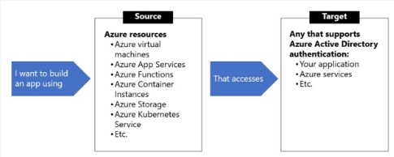

III.2 Implement secure cloud solutions 

jeudi 16 septembre 2021  14:30 

Secure app configuration data by using App Configuration and Azure Key Vault  

**Azure key vault** 

- **Secrets** management : tokens, passwords, certificates (base64), API keys  
- **Key** management 
- **Certificate** management **:** public & private SSL/TLS certificates 

**Why key vault ?** 

- Centralized application secrets 
- Securely store secrets and keys 
- Monitor access and use 
- Simplified administration of application secrets. 

**Best practices**  

- Authentication: 
  - MI for Azure resources : Assign it to VM (or other resources) that has access to KV. No secret rotation management.  
  - Service principal and certificate : Not recommended because the application owner must rotate the certificate. 
  - Service principal and secret : Not recommended because the application owner must rotate the certificate. 
- Use separate key vault per environment 
- Control access to vault  
- Regular backup  
- Logging 
- Turn on soft delete then purge protection 

**Key vault creation**  

**Azure App Configuration**  

**Def :** Store all the settings for your app and secure their access in one place. Complements to Azure Key vault. 

**Why to use :**  

- A fully managed service that can be set up in minutes 
- Flexible key representations and mappings 
- Tagging with labels 
- Point-in-time replay of settings 
- Dedicated UI for feature flag management 
- Comparison of two sets of configurations on custom-defined dimensions 
- Enhanced security through Azure-managed identities 
- Complete data encryptions, at rest or in transit 
- Native integration with popular frameworks 
- Centralize management and distribution of hierarchical configuration data for different environments and geographies 
- Dynamically change application settings without the need to redeploy or restart an application 
- Control feature availability in real-time 

**How to use :** 

With .NET Core : Use the App Configuration provider for .NET Core. 

Key-value pairs based. 

**Keys :**  

- Hierarchical : by using / or : 
- Case-sensitive 
- Unicode based 
- Can have a label attribute (typically used to create multiple version of a key value) 
- Can be queried by specifying a pattern 

**Values :**  

- Unicode strings 

-> Key /values are encrypted at rest & in transit in App Configuration store 

-> Don't store application secrets in App Configuration store, use Key vault instead 

**Feature flag** 

Boolean + associated code block triggered if the boolean is true : if(featureFlag) { do; } Azure App Configuration centralizes all the feature flags for the application. 

Use a **feature manager** (= application package) to handle the lifecycle of all the feature flags and add caching and update states. The feature manager supports appsettings.json as a configuration source for feature flags. 

**Declaration** : (key + true/false or filter) 

**Secure app configuration data** 

-> Enable customer-managed key capability to encrypt configuration data  

- Assign a **MI** to the Azure App configuration instance (must be Standard tier) 
- Grant the identity **GET, WRAP & UNWRAP** permissions in the target Key Vault's access policy. In the key vault, a RSA key is required. The key vault must have soft delete and purge protection enabled. 

-> Use private endpoint to allow client on a VPN to securely access App Configuration instance over a private link. When private endpoint is enabled, it also changes the DNS of the App Configuration. 

-> Use managed identity (system or user-assigned) 

Develop code that uses keys, secrets, and certificates stored in Azure Key Vault  

**Authentication**  

- Using DefaultAzureCredential 

- Interactive authentication 

- User managed identity 

- Custom  

**Manage keys** 

**Add & retrieve a secret** 

**Manage Certificates** 

Implement Managed Identities for Azure resources  

**Def :** Provide an identity for applications to use when connecting to resources that support AAD authentication. **Types of MI :**  

**When to use :**  

**Configuration**  System-assigned  

- During creation of VM :  

- Assignation to existing VM : **az vm identity assign** -g myResourceGroup -n myVm 

User-assigned 

- Create : **az identity create** -g myResourceGroup -n myUserAssignedIdentity 
- Assign during creation of VM 

- Assign to existing VM 

**Get token**  

[GET 'http://169.254.169.254/metadata/identity/oauth2/token?api-version=2018-02- 01&resource=https://management.azure.com/' HTTP/1.1 Metadata: true ](http://169.254.169.254/metadata/identity/oauth2/token?api-version=2018-02-01&resource=https://management.azure.com/)

Implement solutions that interact with Microsoft Graph 

**Def :** RESTful web API that enables to interact with Microsoft cloud services resources. After you register your app and get authentication tokens for a user or service, you can make requests to the Microsoft Graph API. 

**REST :**  

**Permission constraints** 

- **All** grants permission for the app to perform the operations on all of the resources of the specified type in a directory. For example, *User.Read.All* potentially grants the app privileges to read the profiles of all of the users in a directory. 
- **Shared** grants permission for the app to perform the operations on resources that other users have shared with the signed-in user. This constraint is mainly used with Outlook resources like mail, calendars, and contacts. For example, *Mail.Read.Shared*, grants privileges to read mail in the mailbox of the signed-in user as well as mail in mailboxes that other users in the organization have shared with the signed-in user. 
- **AppFolder** grants permission for the app to read and write files in a dedicated folder in OneDrive. This constraint is only exposed on [Files permissions](https://docs.microsoft.com/en-us/graph/permissions-reference#files-permissions) and is only valid for Microsoft accounts. 
- If **no constraint** is specified the app is limited to performing the operations on the resources owned by the signed-in user. For example, *User.Read* grants privileges to read the profile of the signed-in user only, and *Mail.Read* grants permission to read only mail in the mailbox of the signed-in user. 

**Using .NET SDK** 

Library : Microsoft.Graph Create client 

Read info 

Retrieve a list of entities 

Create entity 

Delete entity 

**Best practices**  

- **Authentication** : Use Oauth 2.0 access token (in Authorization header) 
- **Authorization** : least privilege, right permission and consent type 
- **Responses** : Use pagination and cache 
