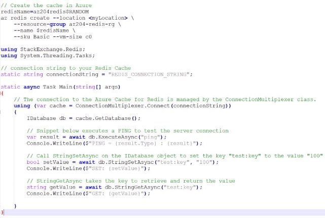
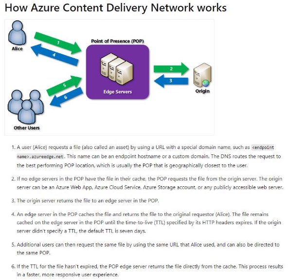
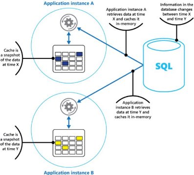
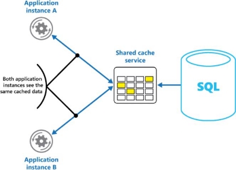
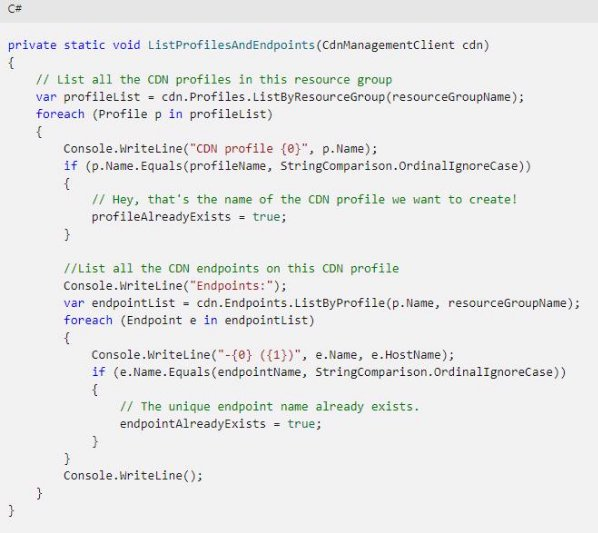
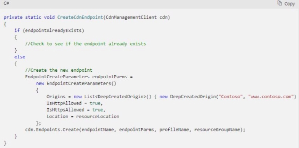

IV.1 Integrate caching and content delivery within solutions 

jeudi 16 septembre 2021  14:31 

Configure cache and expiration policies for Azure Redis Cache 

**Definition :**  

Azure Cache for Redis provides an **in-memory data store** based on the [Redis](https://redis.io/) software. Redis improves the performance and scalability of an application that uses backend data stores heavily. It's able to **process large volumes of application requests** by keeping frequently accessed data in the server memory, which can be written to and read from quickly. Redis brings a **critical low-latency and high- throughput data storage solution** to modern applications. 

Azure Cache for Redis offers both the Redis open-source (OSS Redis) and a commercial product from Redis Labs (Redis Enterprise) as a managed service. It provides secure and dedicated Redis server instances and full Redis API compatibility. The service is operated by Microsoft, hosted on Azure, and usable by any application within or outside of Azure. 

**When to use it :**  

- Data cache  
- Content cache 
- Session store 
- Job and message queuing 
- Distributed transactions 

**Configuration** 

- **Name** : Unique within Azure 
- **Location** : In the same region than the application 
- **Pricing tier** :  
- Basic : 1 node, multiple cache sizes, for dev/test 
- Standard : replicated in 2 nodes, high-availability, SLA 
- Premium : better perf 
- **Virtual network support** : Only premium tier, make the cache available to only other virtual machines and applications in the same virtual network. 
- **Clustering support** : Only premium tier. Automatically split your dataset among multiple nodes. 
- **DNS** **name** 

**Access the instance**  

Via a command-line tool to install : 

COMMAND parameter1 parameter2 parameter3 

Example : Set variable with cache expiration 

Or  

**Interact in .NET** 

**Eviction policy**  

The default policy for Azure Cache for Redis is **volatile-lru**, (lru = less recently used) which means that only keys that have a TTL value set are eligible for eviction. If no keys have a TTL value, then the system won't evict any keys. If you want the system to allow any key to be evicted if under memory pressure, then you may want to consider the **allkeys-lru** policy. 

Implement secure and optimized application cache patterns including data sizing, connections, encryption, and expiration 

**CDN Def :**  

Azure Content Delivery Network (CDN) offers developers a global solution for rapidly delivering high- bandwidth content to users by caching their content at strategically placed physical nodes across the world. Azure CDN can also accelerate dynamic content, which cannot be cached, by leveraging various network optimizations using CDN POPs. For example, route optimization to bypass Border Gateway Protocol (BGP). 

**Why to use it :**  

The benefits of using Azure CDN to deliver web site assets include: 

- Better performance and improved user experience for end users, especially when using applications in which multiple round-trips are required to load content. 
- Large scaling to better handle instantaneous high loads, such as the start of a product launch event. 
- Distribution of user requests and serving of content directly from edge servers so that less traffic is sent to the origin server. 

**How it works :**  

**Caching behavior** 

- **Bypass cache**: Do not cache and ignore origin-provided cache-directive headers. 
- **Override**: Ignore origin-provided cache duration; use the provided cache duration instead. This will not override cache-control: no-cache. 
- **Set if missing**: Honor origin-provided cache-directive headers, if they exist; otherwise, use the provided cache duration. 

3 options :  

- **Ignore query strings**. This option is the default mode. A CDN POP simply passes the request and any query strings directly to the origin server on the first request and caches the asset. New requests for the same asset will ignore any query strings until the TTL expires. 
- **Bypass caching for query strings**. Each query request from the client is passed directly to the origin server with no caching. 
- **Cache every unique URL**. Every time a requesting client generates a unique URL, that URL is passed back to the origin server and the response cached with its own TTL. This final method is inefficient where each request is a unique URL, as the cache-hit ratio becomes low. 

**Time to live** 

If you publish a website through Azure CDN, the files on that site are cached until their TTL expires. The **Cache-Control** header contained in the HTTP response from origin server determines the TTL duration. 

If you don't set a TTL on a file, Azure CDN sets a default value. However, this default may be overridden if you have set up caching rules in Azure. Default TTL values are as follows: 

- Generalized web delivery optimizations: seven days 
- Large file optimizations: one day 
- Media streaming optimizations: one year 

**Private VS Shared caching** 

**Dev in .NET :**  **Create a CDN client**  

**List CDN profiles and endpoints** 

**Create CDN profiles and endpoints** 

**Purge an endpoint** 

