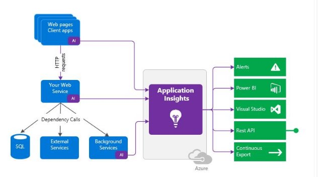
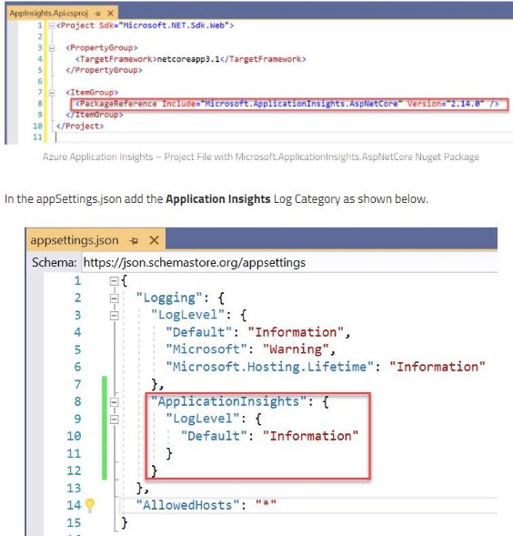
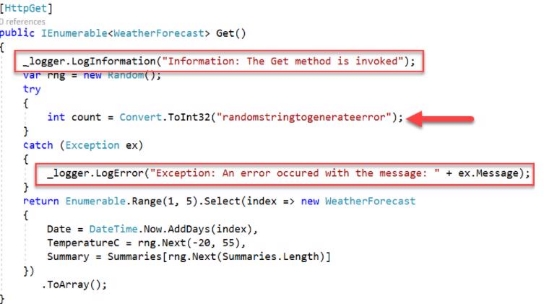
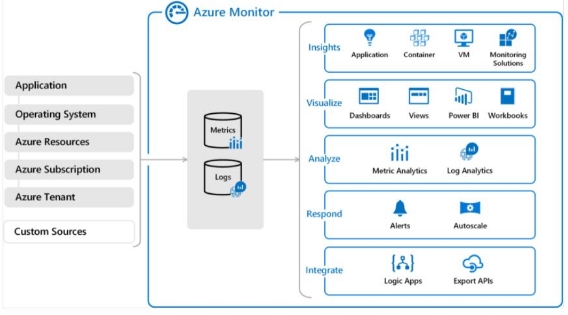

IV.2 Instrument solutions to support monitoring and logging 

jeudi 16 septembre 2021  14:32 

Configure an app or service to use Application Insights  

**Definition  :** App Insights is a feature of Azure Monitor aimed to monitor the availability, performance, and usage of your web applications whether they're hosted in the cloud or on-premises. 

**What is monitored :**  

- Request rates, response times and failure rates 
- Dependancy rates, response times and failure rates, 
- Exceptions 
- Page view & load performance 
- AJAX calls 
- User and session counts 
- Performance counter (CPU, memory, network usage) 
- Host diagnostics 
- Diagnostic trace logs 
- Custom events and metrics 

**Log-based metrics**  

Application Insights log-based metrics let you analyze the health of your monitored apps, create powerful dashboards, and configure alerts. There are two kinds of metrics: 

- Log-based metrics behind the scene are translated into [Kusto queries](https://docs.microsoft.com/en-us/azure/kusto/query/) from stored events. 
- Standard metrics are stored as pre-aggregated time series. 

Since *standard metrics* are pre-aggregated during collection, they have better performance at query time. This makes them a better choice for dashboarding and in real-time alerting.

The *log-based metrics* have more dimensions, which makes them the superior option for data analysis and ad-hoc diagnostics. Use the [namespace selector](https://docs.microsoft.com/en-us/azure/azure-monitor/essentials/metrics-getting-started#create-your-first-metric-chart) to switch between log-based and standard metrics in metrics explorer. 

**Usage analysis features**  

**Funnels :**  You need to know if most customers are progressing through the entire process, or if they're ending the process at some point. 

**Retention :**  How many users return to your app, and how often they perform particular tasks or achieve goals. 

**User flows :**  Visualizes how users navigate between the pages and features of your site.

**Activate telemetry data on server side**  

**Adding TelemetryInitializers** 

**Adding telemetry processors** 

Analyze and troubleshoot solutions by using Azure Monitor 

**Def :** Azure Monitor is a solution for collecting, analyzing, and acting on telemetry from your cloud and on-premises environments. 

Azure Monitor collects :  

- Application monitoring data  
- OS monitoring data 
- Azure resource monitoring data 
- Azure subscription monitoring data 
- Azure tenant monitoring data 

2 types of collected data :  

- Metrics : numerical values that describe some aspect of a system at a particular point in time. 
- Logs : contain different kinds of data organized into records with different sets of properties for each type. 

Where to find data : For many Azure resources, you'll see metric data collected by Azure Monitor right in their Overview page in the Azure portal. Log data collected by Azure Monitor can be analyzed with queries to quickly retrieve, consolidate, and analyze collected data. You can create and test queries using Log Analytics in the Azure portal. 

**Diagnostic settings :**  

Can be activated on any Azure resource. Configuration :  

- Name 
- Choose between : 
  - Archive to storage account 
  - Stream to event hub 
  - Send to log analytics 
- Metrics -> All metrics (with retention days) 

**Insights and curated visualizations :**  

- Application insights 
- Container insights 
- VM insights 

**Azure monitor heartbeat query example** 

// Not reporting VMs 

// VMs that have not reported a heartbeat in the last 5 minutes. // To create an alert for this query, click '+ New alert rule' Heartbeat 

| where TimeGenerated > ago(24h) 

| summarize LastCall = max(TimeGenerated) by Computer 

| where LastCall < ago(5m)

Implement Application Insights web tests and alerts 

**Web Tests :** 

- **URL ping tests (classic)**: You can create this simple test through the portal to validate whether an endpoint is responding and measure performance associated with that response. You can also set custom success criteria coupled with more advanced features, like parsing dependent requests and allowing for retries. Not supporting SSL. 
- **Standard test (preview)**: This single request test is similar to the URL ping test. It includes SSL certificate validity, proactive lifetime check, HTTP request verb (for example GET, HEAD, or POST), custom headers, and custom data associated with your HTTP request. 
- **Custom Track Availability test**: If you decide to create a custom application to run availability tests, you can use the **TrackAvailability()** method to send the results to Application Insights. 

**Alerts :** 

- Open existing AI resource in portal 
- Open Availability pane 
- Use the Add test option to create a new test 
- Select the Open rules(Alerts) page from the new entry's details 
- Set the action group for the generated availability alert 

Types of alerts :  

- On availability metrics  
- On custom analytics queries 
