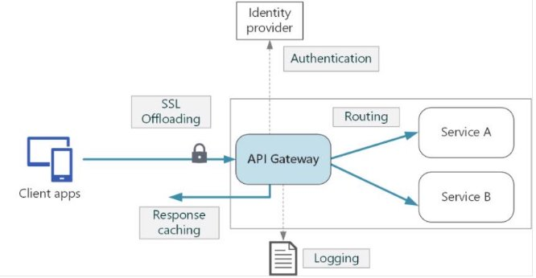
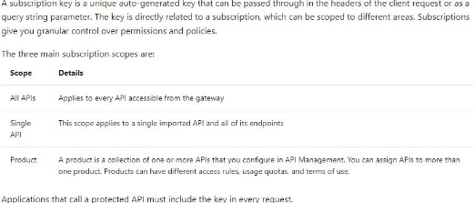
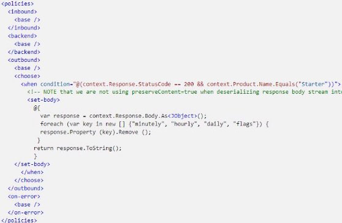

V.1 Implement API Management 

jeudi 16 septembre 2021  14:33 

Create an APIM instance  

**Definition :**  

API Management provides the core functionality to ensure a successful API program through developer engagement, business insights, analytics, security, and protection. Each API consists of one or more operations, and each API can be added to one or more products. To use an API, developers subscribe to a product that contains that API, and then they can call the API's operation, subject to any usage policies that may be in effect. 

**Create** 

**Show** 

In the portal, it is possible to :  

- Create an API  
- Define a backend URL :  
  - Target : Azure Logic App or HTTP Endpoint 
  - Gateway credentials : None, Basic or Client certificate 
- Add versions to this API 
- Add operations to a version of API 
- Add input & output policies at API level and/or operation level 

Configure authentication for APIs  

Use Subscription or Certificate **Subscription** 

**Certificate** 

Certificates can be used to provide Transport Layer Security (TLS) mutual authentication between the client and the API gateway. You can configure the API Management gateway to allow only requests with certificates containing a specific thumbprint. The authorization at the gateway level is handled through inbound policies. 

There are two common ways to verify a certificate: 

- Check who issued the certificate. If the issuer was a certificate authority that you trust, you can use the certificate. You can configure the trusted certificate authorities in the Azure portal to automate this process. 
- If the certificate is issued by the partner, verify that it came from them. For example, if they deliver the certificate in person, you can be sure of its authenticity. These are known as self-signed certificates. 

To check the thumbprint against certificates uploaded to API Management :  

To check the issuer and subject of a client certificate :  

Define policies for APIs 

The configuration is divided into inbound, backend, outbound, and on-error. The series of specified policy statements is executes in order for a request and a response. 

**Examples**  

**Access restriction policies:** 

The **rate-limit** policy prevents API usage spikes on a per subscription basis by limiting the call rate to a specified number per a specified time period. When the call rate is exceeded, the caller receives a 429 Too Many Requests response status code. 

The **rate-limit-by-key** policy prevents API usage spikes on a per key basis by limiting the call rate to a specified number per a specified time period (renewal-period in seconds). The key can have an arbitrary string value and is typically provided using a policy expression. Optional increment condition can be added to specify which requests should be counted towards the limit. When this call rate is exceeded, the caller receives a 429 Too Many Requests response status code. 

The **quota** policy enforces a renewable or lifetime call volume and/or bandwidth quota, on a per subscription basis. 

The **quota-by-key** policy enforces a renewable or lifetime call volume and/or bandwidth quota, on a per key basis. The key can have an arbitrary string value and is typically provided using a policy expression. Optional increment condition can be added to specify which requests should be counted towards the quota. If multiple policies would increment the same key value, it is incremented only once per request. When the call rate is exceeded, the caller receives a 403 Forbidden response status code. 
