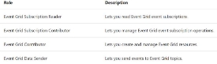
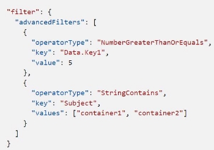
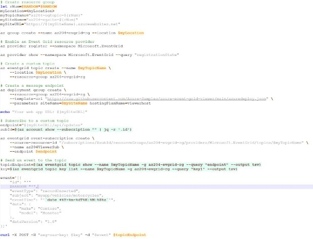
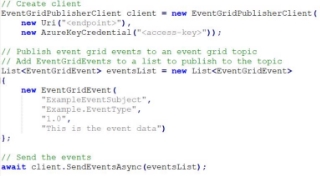
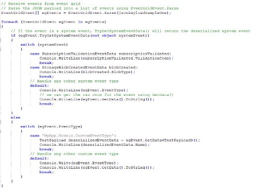
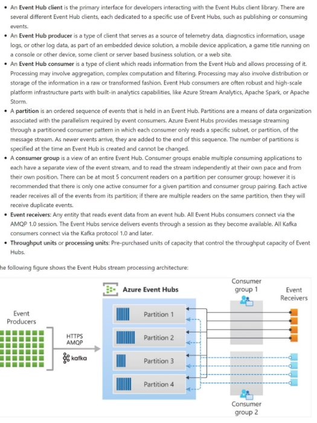
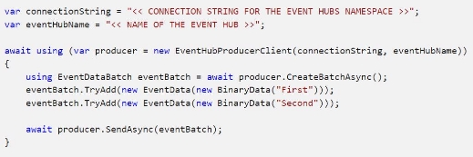
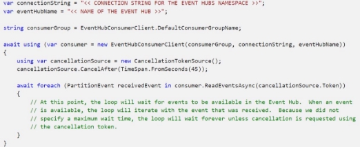
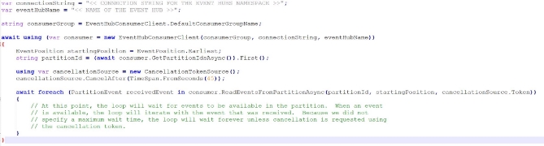
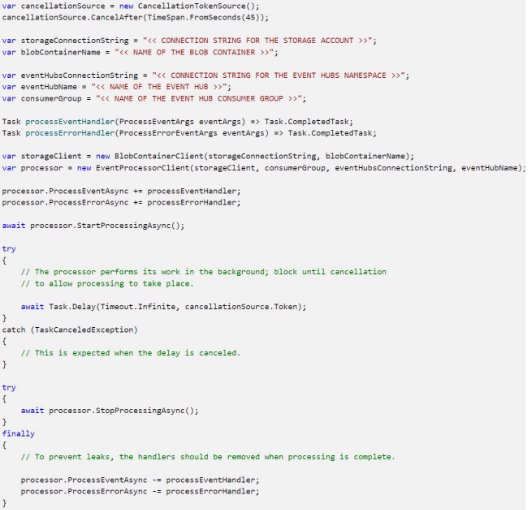

V.2 Develop event-based solutions 

jeudi 16 septembre 2021  14:34 

Implement solutions that use Azure Event Grid  

**Definition** 

- **Events** - What happened. 
- **Event sources** - Where the event took place. 
- **Topics** - The endpoint where publishers send events. 
- **Event subscriptions** - The endpoint or built-in mechanism to route events, sometimes to more than one handler. Subscriptions are also used by handlers to intelligently filter incoming events. 
- **Event handlers** - The app or service reacting to the event. 

**Composition** 

- **Events** - What happened. Smallest amount of info (source, time, id, event-related info). 64KB max. 
- **Event sources** - Where the event took place. Related to one or more event types. For example, IoT Hub is the event source for device created events, Azure Storage for blob created events. 
- **Topics** - The endpoint where publishers send events. The publisher creates the event grid topic and decides whether an event source needs one topic or more than one topic. Subscribers decides which topics to subscribe to. 2 types of topics :  
  - System topics : provided by Azure services, owned by the publisher, only subscribable by providing the info about the resource you want to receive events from. 
  - Custom topics : app & third-party topics. Unlike system's you can see the custom topic in your subscription. 
- **Event subscriptions** - The endpoint or built-in mechanism to route events, sometimes to more than one handler. Subscriptions are also used by handlers to intelligently filter incoming events. It tells Event grid which events on a topic you're interested in receiving. You can filter the event that are sent to the endpoint you provide. Filter by event type, subject pattern or data key. 
- **Event handlers** - The app or service reacting to the event. The place where the event is sent. 

**Event Schema** 

<= 1MB -> if >, 413 payload too large 

**Event delivery** 

**Order not guaranteed** for event delivery. 

If event grid receives an error for an event delivery attempt, 

-> if configuration-related error (400, 403, 413) 

-> dead-letter or drop if not configured 

-> else 

-> wait 30 sec for a response, and retry if no response Delay all subsequent retries  

**Retry policy**  

customizable when creating an event subscription 

**Output batching**  

can be turned on per-subscription (configure the max event per batch & the preferred batch size in kilobytes) 

**Control access to events** **RBAC** Build-in roles :  

The **Microsoft.EventGrid/EventSubscriptions/Write** permission is required on the resource that is the event source in order to subscribe to events in EventGrid 

**Receive events by using Webhooks** 

Trusted Azure webhooks :  

- Logic App with Event Grid connector 
- Azure Automation via Webhook 
- Azure function with Event Grid trigger 

**Receive events in another way**  

Ex: HTTP trigger based Azure function 

-> Synchronous (at the time of event subscription creation) or asynchronous(if third party service used) validation handshake needed 

**Event filtering**  

Subscribers use the subject, event type or data key to filter and route events. By default, all event types are sent. To filter by event type :  

To **filter by subject** 

**To filter by data key** 

**Publish events to event grid in .NET** 

**Receive events from event grid in .NET** 

Implement solutions that use Azure Event Hubs  

**Definition** 

Event Hubs is a intermediary for the pub/sub model. However, unlike Event Grid, it is optimized for a **high throughput**, a **high number of editors, security & resiliency.** It is :  

- Fully managed PaaS 
- Real-time and batch processing 
- Scalable  
- Rich ecosystem 

**Key components**  

**Event Hub Capture**  

Automatically capture streaming/real-time data from Event Hub and put it in Blob or Data lake storage. 

**Scaling, Thread safety and Checkpointing** 

In .NET, use **EventProcessorClient** for reading & processing events.  

Event processor clients can work cooperatively within the context of a consumer group for a given event hub. Clients will automatically manage distribution and balancing of work as instances become available or unavailable for the group. Functions processes the events is called sequentially for a given partition. Each call to the function delivers a single event from a specific partition. Events from different partitions can be processed concurrently and any shared state that is accessed across partitions have to be synchronized.  

Event Processor marks the position of the last successfully processed event within a partition in order to enable another instance to resume processing the partition if the first one disconnects. 

**Access control** **RBAC** Build-in roles :  

Authorize access with :  

- Managed Identity 
- Microsoft Identity Platform 
- SAS 

**Dev**  

Get partitions  

Publish events to an Event Hub 

Read events from an Event Hub 

Read events from an Event Hub partition 

Process events using an Event Processor client 

