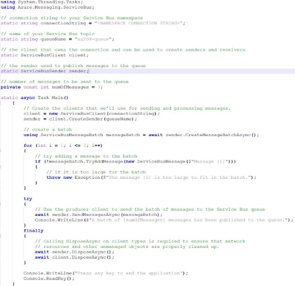
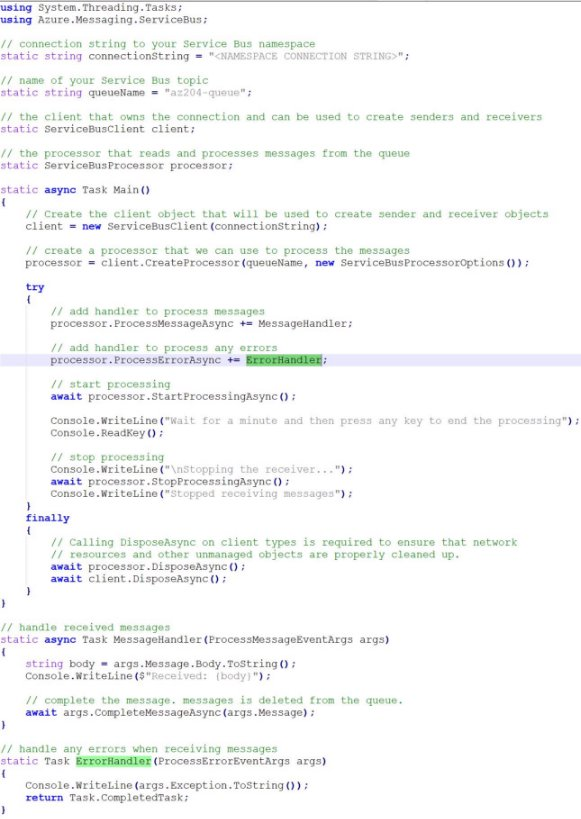
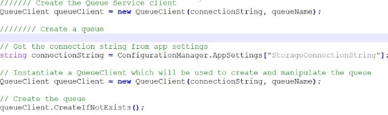
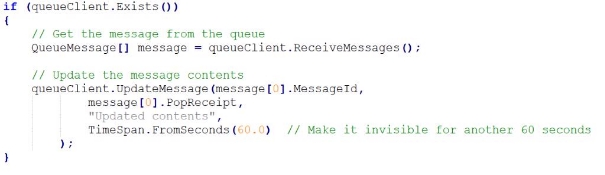

V.3 Develop message-based solutions 

jeudi 16 septembre 2021  14:34 

Implement solutions that use Azure Service Bus 

**Definition :** Fully managed entreprise integration message broker. Follows AMQP protocol. 

**When to use :**  

- Your solution needs to receive messages without having to poll the queue. With Service Bus, you can achieve it by using a long-polling receive operation using the TCP-based protocols that Service Bus supports. 
- Your solution requires the queue to provide a guaranteed first-in-first-out (FIFO) ordered delivery. 
- Your solution needs to support automatic duplicate detection. 
- You want your application to process messages as parallel long-running streams (messages are associated with a stream using the session ID property on the message). In this model, each node in the consuming application competes for streams, as opposed to messages. When a stream is given to a consuming node, the node can examine the state of the application stream state using transactions. 
- Your solution requires transactional behavior and atomicity when sending or receiving multiple messages from a queue. 
- Your application handles messages that can exceed 64 KB but won't likely approach the 256-KB limit. 

**Queues :** 

- FIFO message delivery. Only one consumer receives and processes each message. 

**Receives modes :**  

- Receive and delete : When SB receives the request from the consumer, it marks the message as being consumed an returns it to the consumer application. 
- Peek lock :  
  - Finds the next message to be consumed, locks it and then return the message to the application. 
  - After the application finishes processing the message, it requests the Service Bus service to complete the second stage of the receive process. Then, the service marks the message as being consumed. 

**Topics and subscriptions** 

Unlike queues, provide one-to-many form of communication in a pub/sub pattern. Each published message is made available to each subscription registered with the topic. 

Publisher sends a message to a topic and one or more subscribers receive a copy of the message, depending on filter rules set on these subscriptions. The subscriptions can use additional filters to restrict the messages that they want to receive. 

**Dev : Send messages to a queue** 

**Dev : Receive messages from the queue** 

Implement solutions that use Azure Queue Storage Queue 

**Definition :**  

**When to use :** 

- Your application must store over 80 gigabytes of messages in a queue. 
- Your application wants to track progress for processing a message in the queue. It's useful if the worker processing a message crashes. Another worker can then use that information to continue from where the prior worker left off. 
- You require server side logs of all of the transactions executed against your queues. 

**Components :**  

- URL format: Queues are addressable using the URL format [https://<storage](https://%3Cstorage/) account>.queue.core.windows.net/<queue>. For example, the following URL addresses a queue in the diagram above <https://myaccount.queue.core.windows.net/images-to-download> 
- Storage account: All access to Azure Storage is done through a storage account. 
- Queue: A queue contains a set of messages. All messages must be in a queue. Note that the queue name must be all lowercase. 

The associated metric name is **ActiveMessageCount** (= messages that are in an active state and ready for delivery) 

- Message: A message, in any format, of up to 64 KB. For version 2017-07-29 or later, the maximum time-to-live can be any positive number, or -1 indicating that the message doesn't expire. If this parameter is omitted, the default time-to-live is seven days. 

**Dev**  

**Create a queue** 

**Insert a message into a queue** 

**Peek at the next message : (read it without removing it from the queue)** 

**Change the contents of a queued message** 

**Dequeue the next message** 

**Get the queue length** 

**Delete a queue** 

